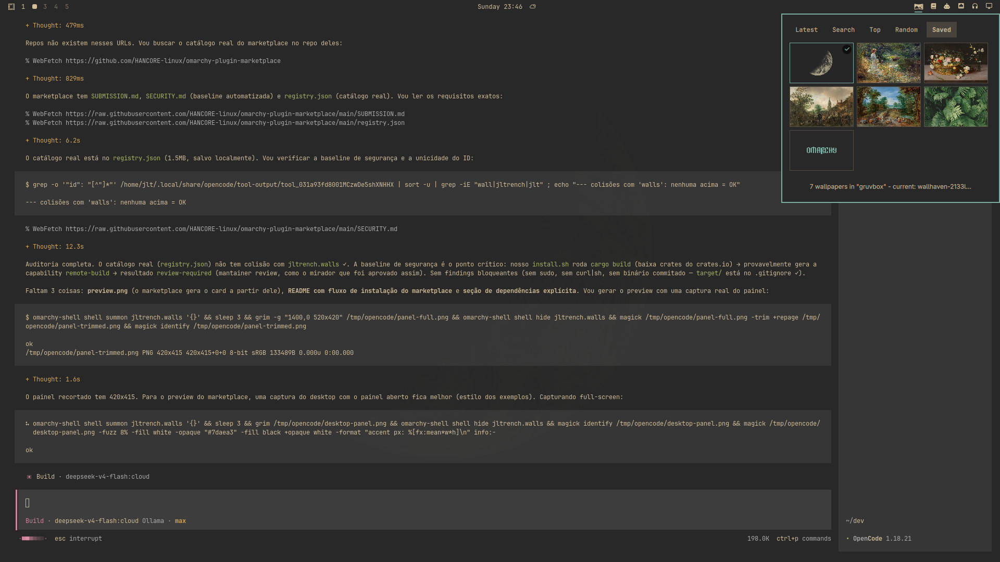

# Walls

[](LICENSE)


Native Omarchy Quattro bar widget to find wallpapers that match your theme.
Browse Latest / Top / Random listings, search by keyword, or search by the
colors of your **active Omarchy theme** — then apply any wallpaper with one
click.

Powered by [wallhaven.cc](https://wallhaven.cc). Walls is an independent
project and is not affiliated with, sponsored by, or endorsed by wallhaven.cc.
All wallpapers remain the property of their original owners.



## Features

- **Theme-matched search** — reads `~/.local/state/omarchy/current/theme/colors.toml`,
  maps each curated theme color (accent, red, yellow, green, cyan...) onto the
  wallhaven color filter with a perceptual nearest-match, and offers one-click
  chips. Desaturated themes are deduplicated so you never get rows of
  identical gray searches.
- **Four browsing modes** — Latest, Top (with 1d→1y range selector), Random
  and Saved. Random keeps the API seed across pages so nothing repeats. The
  query field is global: type and press Enter from any tab to search, × to
  return to the tab listing.
- **Saved library tab** — every wallpaper of the active theme in one grid:
  the current background is marked, hover a tile to apply it, and
  user-downloaded files can be removed (stock theme files are protected).
- **One-click apply** — downloads the full-resolution image into the current
  theme's backgrounds folder (`~/.config/omarchy/backgrounds/<theme>/`) and
  sets it immediately via `omarchy theme bg set`. Downloaded wallpapers join
  your theme rotation (`omarchy theme bg next`) and survive updates.
- **SFW by default** (`purity=100`), respectful of the public API's
  rate limit.
- **Rust engine** — a small `walls` CLI (`ureq`, zero heavyweight deps) with
  unit tests; QML panel built on the Omarchy shell kit (`qs.Ui`).

## Install

### From the Omarchy plugin marketplace

```sh
omarchy plugin add https://github.com/jltrench/walls.git --enable
cd ~/.config/omarchy/plugins/jltrench.walls && make install
omarchy bar move jltrench.walls --section right
```

The marketplace install clones the repository; `make install` builds the Rust
binary into the plugin folder (requires `cargo`/`rustc` at build time only).
No sudo needed; everything lives in `~/.config/omarchy/plugins/jltrench.walls/`.

### From this repository

```sh
git clone https://github.com/jltrench/walls.git
cd walls
make install                                  # builds native/ + installs plugin
omarchy plugin enable jltrench.walls right    # adds the widget to the bar
```

### Updating / removing

```sh
git pull && make install      # update in place
make remove                   # uninstall (downloaded wallpapers are kept)
```

## Dependencies

- **Runtime**: `omarchy theme bg set` / `omarchy theme bg next` (part of
  Omarchy), network access to wallhaven.cc.
- **Build time**: `cargo`/`rustc` (Rust crates: `ureq`, `serde`,
  `serde_json` — fetched from crates.io during `make install`).
- No system services, no elevated privileges, no user configuration is
  overwritten.

## Usage

Click the image icon in the bar:

| Control | Action |
| --- | --- |
| Tabs | Switch between Latest, Top, Random and Saved |
| Range button | Cycle toplist range (visible on the Top tab) |
| Query + Enter | Search from any tab (× clears and returns to the tab) |
| Color chip | Search wallpapers matching that theme color (click again to clear) |
| Thumbnail | Download & apply as wallpaper |
| Saved tile hover | Apply (✓) or remove (🗑, user files only) |
| ‹ / › | Previous / next page |
| Esc | Clear query, then close |

Applied wallpapers also land in the theme's folder, so they cycle with
`omarchy theme bg next` and re-apply automatically whenever you switch back to
the theme.

### CLI

The same engine is usable standalone:

```sh
~/.config/omarchy/plugins/jltrench.walls/bin/walls search "mountains" --page 2
walls search --sort toplist --range 1w          # weekly toplist
walls search --sort random                      # fresh seed each run
walls search --color 66cccc                     # fixed palette filter
walls theme-colors                              # active theme -> palette mapping
walls apply qroevq                              # download + omarchy theme bg set
walls list                                      # saved + stock wallpapers of the theme
walls set ~/Pictures/photo.png                  # apply a local image
walls remove ~/.config/omarchy/backgrounds/gruvbox/wallhaven-qroevq.jpg
```

Search output is JSON (`{"results": [...], "page": n, "seed": s}`) so it can
be piped into `jq`.

## How theme colors work

wallhaven's API only accepts colors from a [fixed 28-entry palette](https://wallhaven.cc/help/api).
Walls parses your theme's `colors.toml`, converts each curated key to RGB,
snaps near-neutral colors onto the grayscale ramp (so dark themes don't match
brown), and picks the closest palette entry by weighted euclidean distance:

```sh
$ walls theme-colors | jq -c '.colors[] | .name + " " + .hex + " -> " + .matched'
accent #7daea3 -> #999999
red #ea6962 -> #ea4c88
orange #e1875c -> #cc6633
yellow #d8a657 -> #cccc33
```

## Development

```sh
make build       # cargo build --release
make test        # cargo unit tests (URL building, palette math, TOML scan...)
make lint        # qmllint against the installed shell imports
make validate    # manifest validation via omarchy plugin validate
```

Layout:

```
manifest.json     Plugin manifest (marketplace contract)
BarWidget.qml     Bar entry point (SVG icon recolored per theme)
Panel.qml         Search/browse panel state + processes
ResultGrid.qml    Thumbnail grid component
SavedGrid.qml     Local wallpaper library grid (apply/remove overlay)
icon.svg          Bar icon (Phosphor image icon)
native/src/api.rs   wallhaven.cc API v1 client
native/src/palette.rs  Fixed color palette + nearest-match logic
native/src/theme.rs colors.toml scanning
native/src/library.rs  Local wallpaper library (list/set/remove)
native/src/model.rs serde types
native/src/main.rs  CLI dispatch
```

Saved changes under `~/.config/omarchy/plugins/` hot-reload; force with
`omarchy-shell shell rescanPlugins`. If a change refuses to apply (stale QML
disk cache), run `omarchy restart shell`. Inspect runtime errors with
`qs log -p "$OMARCHY_PATH/shell" --tail 100` — the panel logs every `walls`
invocation and any parse failure with full context under the `walls` tag.

## Acknowledgements

- [wallhaven.cc](https://wallhaven.cc) for the free public API v1.
- The Omarchy shell kit and its built-in plugins, used as reference for the
  panel lifecycle (`Panel`, `KeyboardPanel`, `WidgetButton`).
- Icon: Phosphor Icons (MIT).

## License

[MIT](LICENSE).
